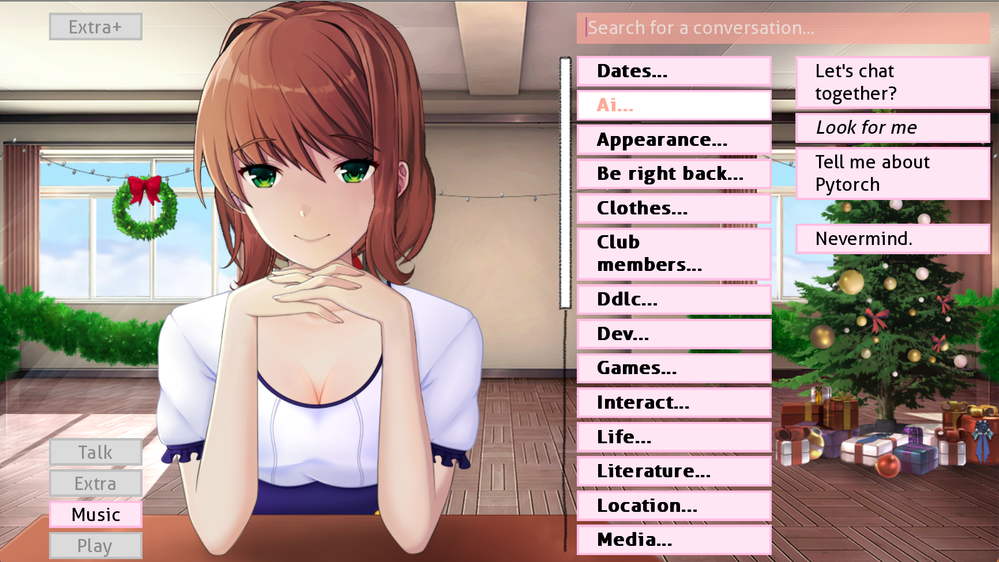

<h1 align="center"> :computer: MonikA.I. submod </h1>

<p align="center">
  <a href="https://github.com/Rubiksman78/MonikA.I./releases/latest">
    
  </a>
  <a href="https://github.com/Rubiksman78/MonikA.I./releases">
    
  </a>
</p>

This project aims to add new AI based features to [Monika After Story mod](https://github.com/Monika-After-Story/MonikaModDev) with the submod API.
It's using HuggingFace DialoGPT models, [TTS Coqui-AI](https://github.com/coqui-ai/TTS) for Text to Speech, [OpenAI Whisper](https://github.com/openai/whisper) with [microphone option](https://github.com/mallorbc/whisper_mic) for Speech to Text and [Character AI](https://character.ai/) for more realistic responses. An [emotion detection from text model](https://huggingface.co/michellejieli/emotion_text_classifier) is also used linked with the chatbot.
There is also emotion detection with the webcam with a model from [HSEmotion](https://github.com/HSE-asavchenko/face-emotion-recognition) (`facial_analysis.py`,`enet_b2_7.pt`,`mobilenet_7.h5`)

*Disclaimer: This project adds features (chatbots) that can be imprevisible and may not be in total accordance with the usual way Monika is supposed to speak. The goal is to have fun free interactions when running out of topics for example. There are also a lot of libraries and models involved so it can make the game slower when using them.*

## :fire: Features

- Allow Monika to finally see you through the webcam and react to your emotions
- Speak without scripted text with Monika using the latest chatbots from Character AI or HuggingFace DialoGPT
- Hear Monika speak with a Text to Speech module using extracts of voiced dialogues (still in development)
- Gain affection points by talking with Monika, the more you make her feel positive emotions, the more she will love you.


## ❓Installation

- If you have `bash` (you can install [Git Bash](https://git-scm.com/downloads) on Windows if needed): Run the setup with ```bash setup.sh``` that will install the requirements for the project and the requirements for the TTS module
- Else: Just do `pip install -r requirements.txt`, it won't install TTS so be sure to set `--use_audio False` later. If you still want to use TTS, you can follow the instructions [here](https://tts.readthedocs.io/en/latest/tutorial_for_nervous_beginners.html).

## :heavy_plus_sign: Add to the game

The submod is the folder `AI_submod`. To add it to your game, you have to add it in your game folder to `game/Submods/`.

## :loudspeaker: Usage

Because of the high usage of Machine Learning algorithms, the inference can be quite long on CPU so it is advised to have a functional GPU for a better experience.

To use it, you can launch the script `combined_server.py` that will automatically launch a server with chatbot and emotion recognitions models, it will also launch the game and initialize the client/server connection. 

Don't launch the game independently, it will cause conflicts with the process that will automatically launch the game in the main.

There are several arguments you can use in command line:
- `--game_path` : the absolute path to your game directory like `some_path\DDLC-1.1.1-pc`
- `--chatbot_path` : the relative path to the chatbot model like `chatbot_model` (There is actually no model in the repository because of the better performances of the Character AI website)
- `--use_character_ai` : if you want to use the character AI website, `True` or `False`
- `--use_chatbot` : if you want to use the chatbot, `True` or `False`
- `--use_emotion_detection` : if you want to use the emotion detection with the webcam, `True` or `False`
- `--use_audio` : if you want to use the TTS module, `True` or `False`. Warning, the audio model is quite long to load, so it can take a while before the sound plays.
- `--emotion_time`: the number of minutes between each webcam capture for emotion detection
- `--display_browser`: whether or not you want to see the simulated browser (useful when having to solve captcha)
- `--choose_character`: switch between the character you prefer 

You have to create a json file `auth.json` with keys `USERNAME` and `PASSWORD` with your credentials for the character AI website:
```
{
  "USERNAME":****@****,
  "PASSWORD":*****
}
```
  
When the browser page launches, you may have to solve the captcha yourself and then go back to the game, your ids will be filled automatically.

You can change the voice used by replacing the extract `talk_13.wav` in the `audio` folder by another audio extract. The longer the extract, the longer the TTS will take to generate the audio at each turn.

## :video_game: In Game

The features are available in a specific `AI` Talk menu in the game.


- Click on `Let's chat together` to use the Character AI Chatbot
- Click on `Look for me` to use the facial emotions detection in an interactive session
- Click on `Tell me about Pytorch` if you think it is superior to Tensorflow

## :cinema: Video Demonstration

https://user-images.githubusercontent.com/66365083/209359921-a4fdad5e-abbd-4550-a1fb-62d695e76c51.mp4

## :alarm_clock: To develop
- Convert `playwright` browser simulator to python `requests` for faster run and no parasite window
- Speech to text to convert your own voice in text and directly speak with Monika :white_check_mark:
- Better face emotions detection :white_check_mark:
- Face recognition for Monika only to recognize you
- Add possibility to see when microphone starts recording in the game for STT
- *Feel free to suggest improvements or new AI features you would like to see*
