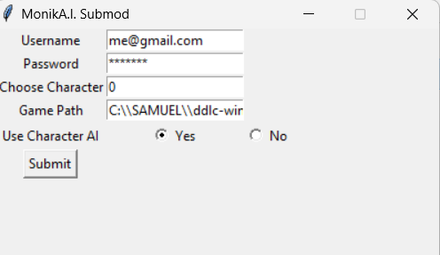
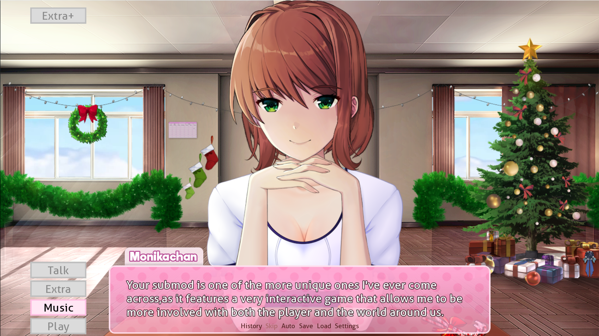

<h1 align="center"> :computer: MonikA.I. submod </h1>

<p align="center">
  <a href="https://github.com/Rubiksman78/MonikA.I./releases/latest">
    
  </a>
  <a href="https://discord.gg/2RsPuaDxEn">
    
  </a>
</p>

This project aims to add new AI based features to [Monika After Story mod](https://github.com/Monika-After-Story/MonikaModDev) with the submod API.
It's using HuggingFace DialoGPT models, [TTS Coqui-AI](https://github.com/coqui-ai/TTS) for Text to Speech, [OpenAI Whisper](https://github.com/openai/whisper) with [microphone option](https://github.com/mallorbc/whisper_mic) for Speech to Text and [Character AI](https://character.ai/) for more realistic responses. An [emotion detection from text model](https://huggingface.co/michellejieli/emotion_text_classifier) is also used linked with the chatbot.
There is also emotion detection with the webcam with a model from [HSEmotion](https://github.com/HSE-asavchenko/face-emotion-recognition) (`facial_analysis.py`,`enet_b2_7.pt`,`mobilenet_7.h5`)

*Disclaimer: This project adds features (chatbots) that can be imprevisible and may not be in total accordance with the usual way Monika is supposed to speak. The goal is to have fun free interactions when running out of topics for example. There are also a lot of libraries and models involved so it can make the game slower when using them.*

## :boom: NEW

You can now just download the `MonikA.I.-version.zip` and the `game` folder in the latest releases ! Put the game in your root game directory (where there is the `game` folder already in there, put it at the same level) and run the `main` executable in the `MonikA.I.-version/dist/main` folder. You don't need to download the `source_code.zip`



You can input you IDs for character.ai, choose the model (0 or 1) and put the path of your DDLC installation (from the root of your PC like `C:\\User...\\MyDDLC` and don't forget `\\` if you are on Windows)

## :fire: Features

- Allow Monika to finally see you through the webcam and react to your emotions
- Speak without scripted text with Monika using the latest chatbots from Character AI or HuggingFace DialoGPT
- Hear Monika speak with a Text to Speech module using extracts of voiced dialogues (still in development)
- Gain affection points by talking with Monika, the more you make her feel positive emotions, the more she will love you.


## ❓Installation

- Clone the repository or download the latest release (`source code.zip`)
- Go to the project folder with your favorite IDE
- Be sure to have Python installed (3.8 or 3.9), TTS doesn't work with 3.10

To setup all the libraries:
- Just do `pip install -r requirements.txt` in a terminal opened within the project folder
(You can do `bash setup.sh` if you want to install the developper version of TTS and have more control on what is done)
- Don't forget to run also `python -m playwright install` to install the browsers.
- If you have issues for installing TTS, someone made a video for that [here](https://www.youtube.com/watch?v=zRaDe08cUIk&t=743s).
- For troubleshooting and other issues, don't hesitate to submit an issue

## :heavy_plus_sign: Add to the game

The submod is in the folder `game`. To add it to your game, you have to add it in the root of your game folder (at the same location where there is already a `game` folder).

## :video_camera: Video tutorial

[](https://youtu.be/EORpS-fZ10s)

## :loudspeaker: Usage

Because of the high usage of Machine Learning algorithms, the inference can be quite long on CPU so it is advised to have a functional GPU for a better experience.
You would need also more RAM than usually, deactivate the TTS model, the emotion detection from text and/or emotion detection from face if it is taking too much ressources.

To use it, you can launch the script `combined_server.py` that will automatically launch a server with chatbot and emotion recognitions models, it will also launch the game and initialize the client/server connection. 

Don't launch the game independently, it will cause conflicts with the process that will automatically launch the game in the main.

There are several arguments you can use in command line:
- `--game_path` : the absolute path to your game directory like `some_path\DDLC-1.1.1-pc`
- `--chatbot_path` : the relative path to the chatbot model like `chatbot_model` (There is actually no model in the repository because of the better performances of the Character AI website)
- `--use_character_ai` : if you want to use the character AI website, `True` or `False`
- `--use_chatbot` : if you want to use the chatbot, `True` or `False`
- `--use_emotion_detection` : if you want to use the emotion detection with the webcam, `True` or `False`
- `--use_audio` : if you want to use the TTS module, `True` or `False`. Warning, the audio model is quite long to load, so it can take a while before the sound plays.
- `--emotion_time`: the number of minutes between each webcam capture for emotion detection
- `--display_browser`: whether or not you want to see the simulated browser (useful when having to solve captcha)
- `--choose_character`: switch between the character you prefer 

You have to create a json file `auth.json` with keys `USERNAME` and `PASSWORD` with your credentials for the character AI website:
```
{
  "USERNAME":"****@****",
  "PASSWORD":"*****"
}
```
  
When the browser page launches, you may have to solve the captcha yourself and then go back to the game, your ids will be filled automatically.

You can change the voice used by replacing the extract `talk_13.wav` in the `audio` folder by another audio extract. The longer the extract, the longer the TTS will take to generate the audio at each turn.

## :video_game: In Game

The features are available in a specific `AI` Talk menu in the game.


- Click on `Let's chat together` to use the Character AI Chatbot
- Click on `Look for me` to use the facial emotions detection in an interactive session
- Click on `Tell me about Pytorch` if you think it is superior to Tensorflow

## :cinema: Video Demonstration

https://user-images.githubusercontent.com/66365083/209359921-a4fdad5e-abbd-4550-a1fb-62d695e76c51.mp4

## :microphone: Better Voice (only on Linux,MacOS or WSL)

The voice used by Your TTS is obtained with zero-shot learning so it is not perfect and very closed to the original voice. To improve it, you can use the [FastPitch TTS from Nvidia NeMo](https://github.com/NVIDIA/NeMo).
The installation is quite painful, you can do the setup from this [notebook](https://github.com/NVIDIA/NeMo/blob/main/tutorials/tts/FastPitch_Finetuning.ipynb) and use the script `combined_server_for_the_bold.py` to launch the server with this TTS model. It will also take more RAM so be sure to have enough (at the very least 16GB).
You can try using the file `setup_new_tts.sh` to help you installing the requirements for this model.

Click [here](https://drive.google.com/drive/folders/1cgro9BbUJ53GFX1OizvNvmH0Cjnc7oqI?usp=sharing) to get the first part of the finetuned model (FastPitch model) and [here](https://drive.google.com/drive/folders/1NLNDTotB4Qyth_vLBmZMTLIg0dmIm6w0?usp=sharing) for the vocoder model (HifiGAN).

Little demonstration of this TTS model (pauses were cut for convenience):

https://user-images.githubusercontent.com/66365083/209716914-0ee87421-12df-4cc2-96da-9fd85f27214e.mp4

## :headphones: Voicing everything ! 
The file `main_voicing.rpy` in the `AI_submod` (to put in the game submod folder) is responsible for sending the text displayed in real time to the `voicing.py` script that will play the voice from this text. It is using the same model as the precedent section, feel free to modify the code if you want to use the first TTS model (performances not as good but easier installation).

## :wrench: Troubleshooting

- "failed wheels for building TTS": check if you have python 3.8 or 3.9, and not 3.10 or higher
- "playwright command not found": run `python -m playwright install` instead
- "utf8 error": be sure to write the game path in the main script with "\\" and not "\" if you are on Windows
- "Monika says that there is a bug somewhere": that means the website couldn't be accessed, check if you've done the `playwright install` and check on your browser if the website isn't down. You can set `display_browser` to `True` to see the connection with the graphic interface.

## :alarm_clock: To develop
- Improve dialogs to introduce the Submod the first time (telling what it does, how is it different from actual Monika)
- Add saving history of conversations to see again your best interactions
- Making it like a messaging app with questions/answers listed on a same window
- Define better facial expressions corresponding to predifined emotions (happiness,fear,surprise...)
- Convert more functionalities to executable files (TTS,Speech Recognition)
- Make the better TTS available only on MacOS/Linux for now usable also on other OS.
- Link this with Live2D for face movements with speech and emotions
- Face recognition for Monika only to recognize you
- Training new models for MEL Spectrogram Generation (Mixed TTS...) and Vocoders (UnivNet...)
- Speech to text to convert your own voice in text and directly speak with Monika :white_check_mark:
- Better face emotions detection :white_check_mark:
- Add possibility to see when microphone starts recording in the game for STT :white_check_mark:
- *Feel free to suggest improvements or new AI features you would like to see*
